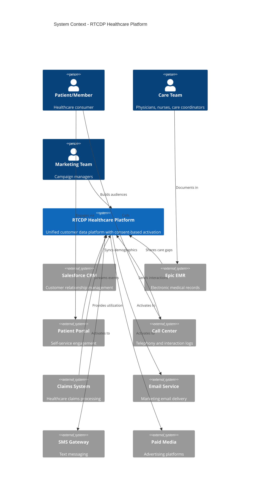
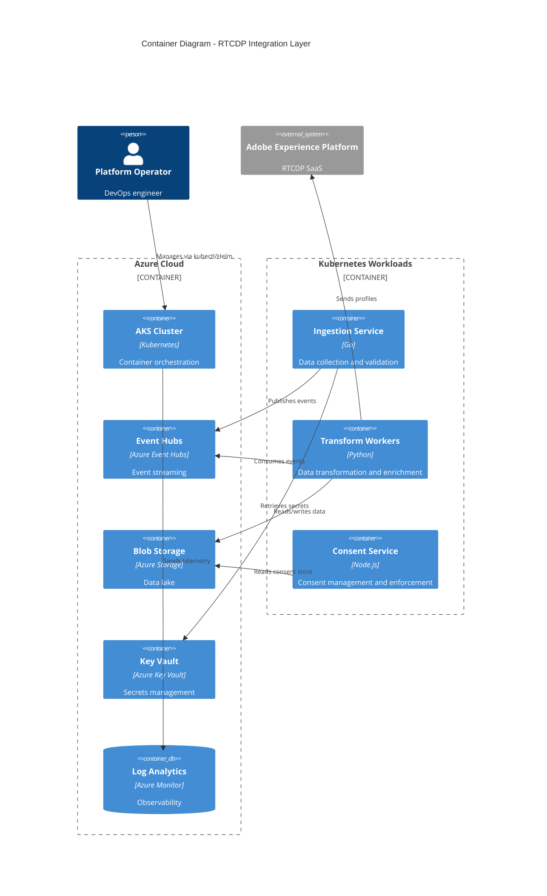
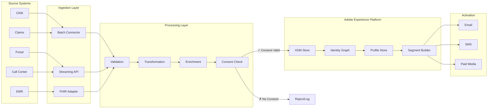
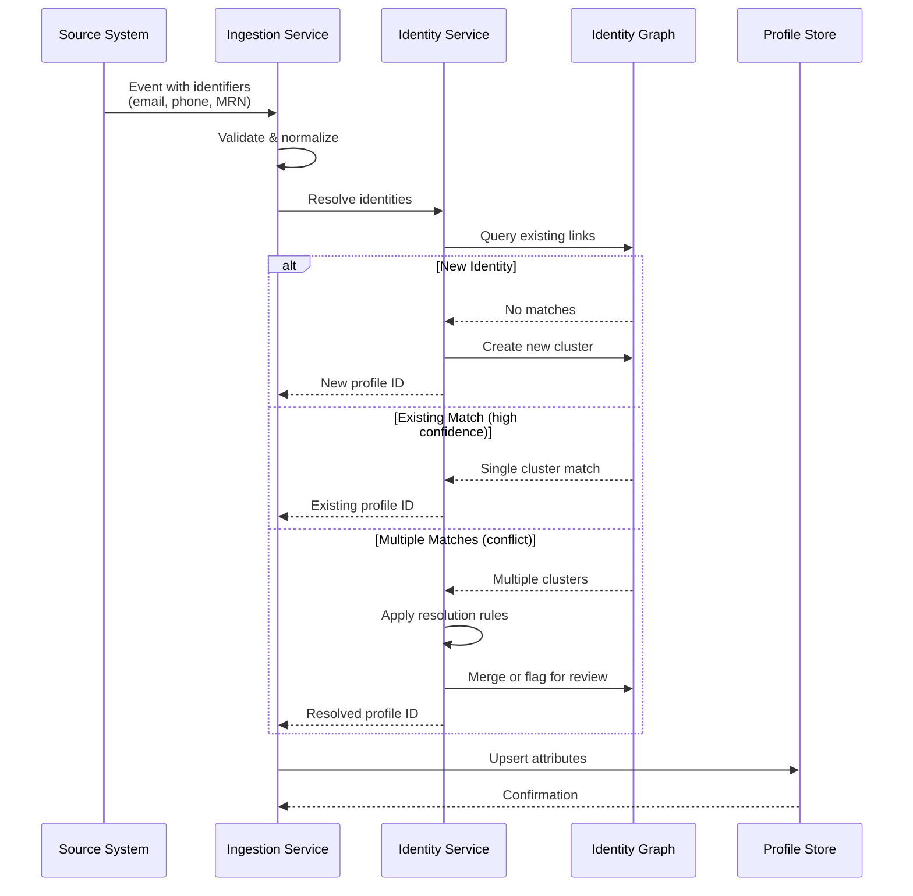
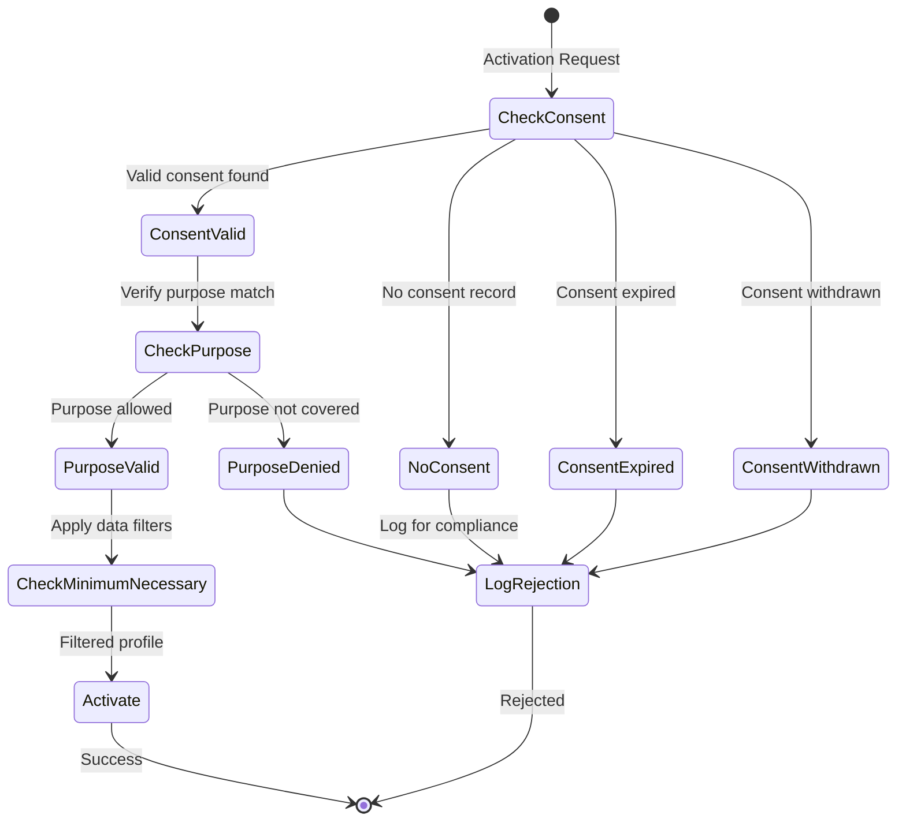
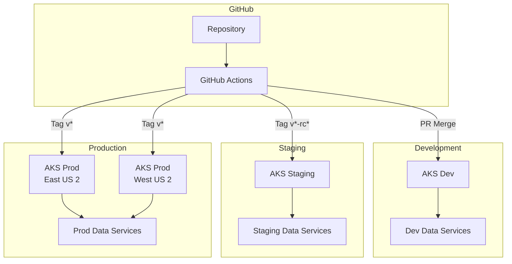
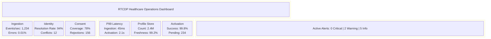

# Architecture Diagrams

This section contains visual representations of the RTCDP Healthcare architecture components.

## System Context Diagram

## Container Diagram

## Data Flow Diagram

## Identity Resolution Flow

## Consent Enforcement

## Deployment Architecture

## Monitoring Dashboard Layout

