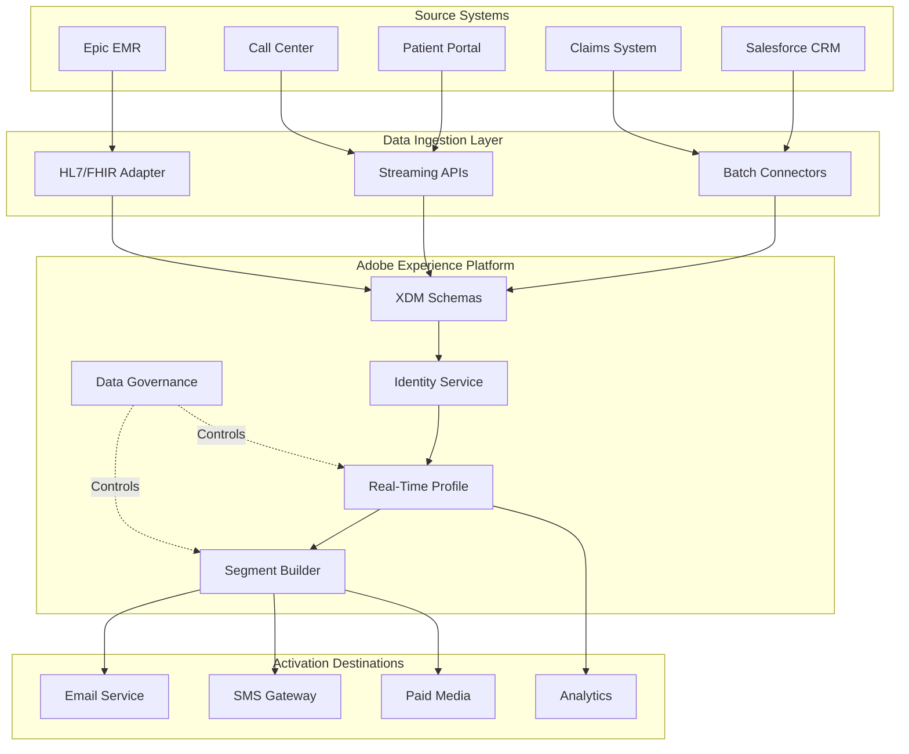

# Architecture Overview

This section contains the technical architecture for the Adobe RTCDP Healthcare implementation, covering data ingestion, schema design, identity resolution, and activation patterns.

## Architecture Components

## Key Architecture Documents

| Document | Description | Audience |
|----------|-------------|----------|
| [Source System Architecture](source-system-architecture.md) | Detailed mapping of CRM, EMR, portal, call center, and claims systems | Data Engineers, Architects |
| [XDM Schema Design](xdm-schema-design.md) | Profile and event schemas, field groups, namespaces | Data Modelers, Developers |
| [Identity Stitching Flow](identity-stitching-flow.md) | MRN, ECID, member ID resolution logic | Identity Engineers |
| [Audience Design](audience-design.md) | Segment definitions with consent gates | Marketing Ops, Compliance |
| [Activation Architecture](activation-architecture.md) | Destination configuration, latency requirements, fallback patterns | Platform Engineers |

## Design Principles

!!! tip "Trust Before Activation"
    No audience member qualifies for activation without:
    
    - Resolved identity (high-confidence match across sources)
    - Valid consent for the specific use case
    - Compliance with minimum necessary standard

### Data Flow Principles

1. **Source of Truth Hierarchy** — EMR data takes precedence for clinical attributes; CRM for engagement preferences
2. **Event-Driven Updates** — Profile changes trigger downstream evaluations within SLA windows
3. **Consent as First-Class Citizen** — Consent attributes are evaluated before any activation decision
4. **Audit Everything** — All profile accesses and activations are logged for HIPAA compliance

## Integration Patterns

### Batch Ingestion
- **Frequency**: Daily for CRM/Claims, Weekly for EMR reconciliation
- **Format**: CSV/Parquet via Cloud Storage connectors
- **Validation**: Schema validation + deduplication before merge

### Streaming Ingestion
- **Sources**: Patient Portal (web SDK), Call Center (event API)
- **Latency**: Sub-second event capture, <5 minute profile merge
- **Backpressure**: Queue-based buffering with dead-letter handling

### FHIR/HL7 Integration
- **Standard**: FHIR R4 for EMR data exchange
- **Transform**: FHIR-to-XDM mapping layer
- **PHI Handling**: Field-level encryption + data usage labels
