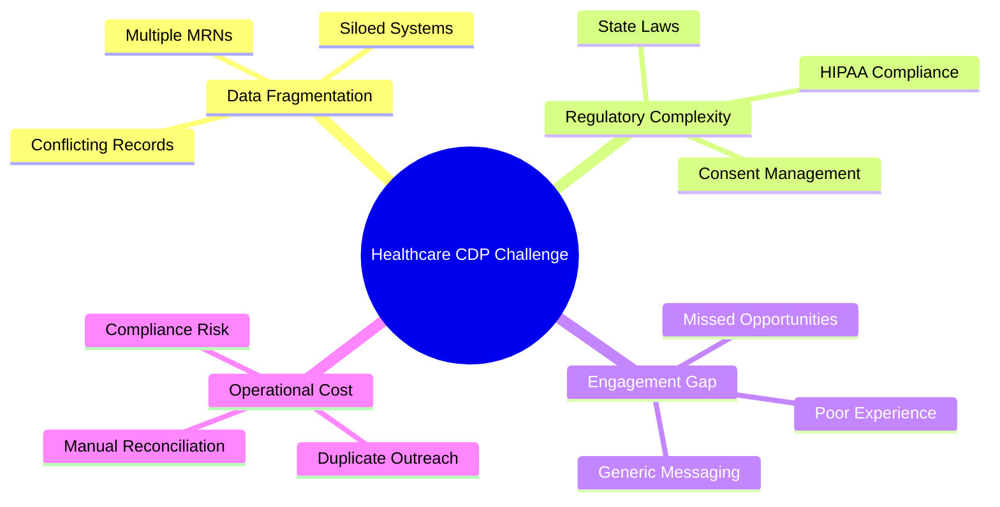
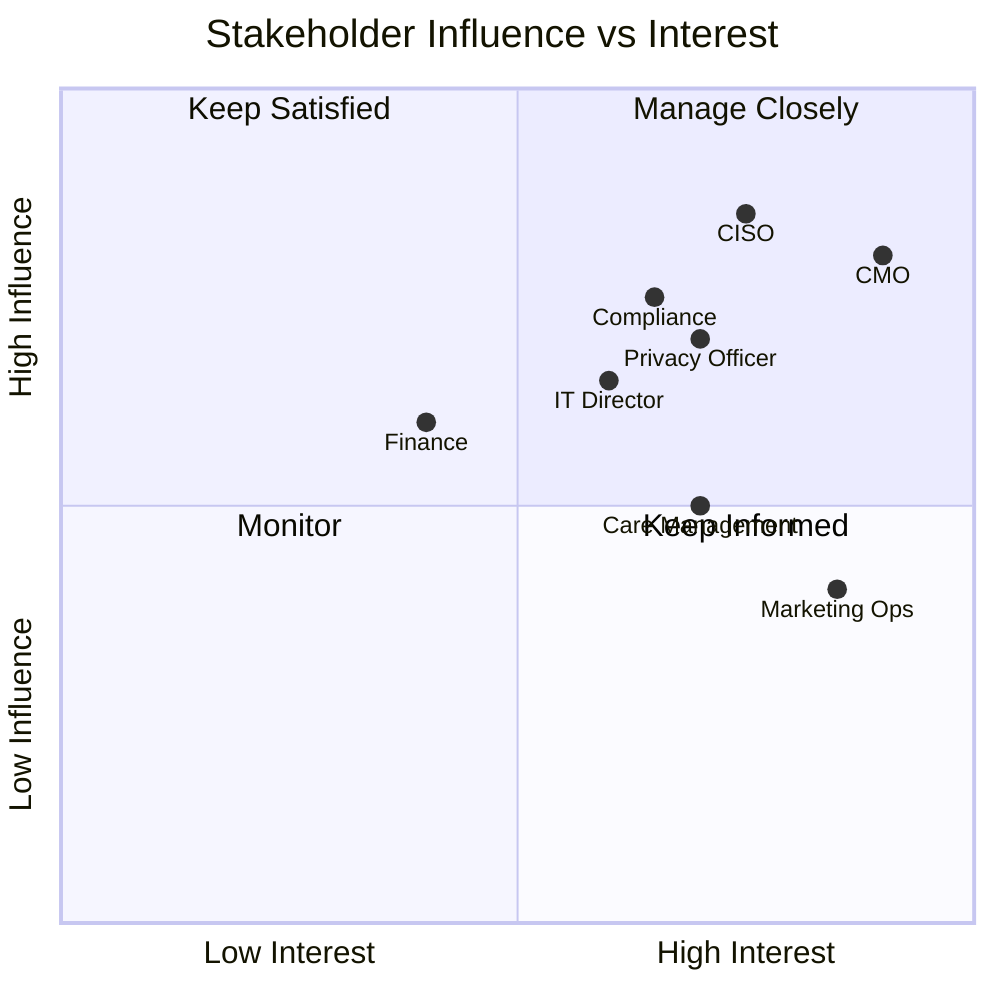

# Business Context

This section provides the business framing, stakeholder analysis, and success metrics for the RTCDP implementation.

## Business Problem Statement

Healthcare organizations face a fundamental challenge: **fragmented patient/member data across operational silos prevents personalized, timely engagement** while regulatory constraints demand careful handling of sensitive information.

## Key Business Documents

| Document | Description | Audience |
|----------|-------------|----------|
| [Business Problem & Stakeholder Map](business-problem-stakeholder-map.md) | Detailed problem statement, stakeholder analysis, and organizational impact | Executives, Project Sponsors |
| [KPI Framework](kpi-framework.md) | Success metrics across activation, engagement, data quality, and compliance | Leadership, Analytics Teams |

## Value Proposition

### For Patients/Members

- **Relevant Communications**: Messages that reflect their actual health journey
- **Reduced Friction**: No repeated information requests across touchpoints
- **Privacy Respect**: Clear consent controls and transparency

### For Care Teams

- **Complete View**: Unified profile across clinical and engagement data
- **Actionable Insights**: Care gap identification and intervention triggers
- **Efficiency**: Reduced time spent reconciling patient information

### For the Organization

- **Revenue Protection**: Improved retention through better engagement
- **Cost Reduction**: Eliminated duplicate outreach and manual reconciliation
- **Risk Mitigation**: Documented compliance and audit trails

## Stakeholder Map

## Success Metrics Overview

!!! info "Measurement Philosophy"
    Success is measured across four dimensions: activation effectiveness, engagement quality, data integrity, and compliance adherence.

### Leading Indicators (Monthly)

| Metric | Target | Baseline |
|--------|--------|----------|
| Profile Unification Rate | >85% | 62% |
| Consent Capture Rate | >70% | 45% |
| Identity Resolution Confidence | >90% | 78% |
| Data Freshness (Median Age) | <48 hrs | 7 days |

### Lagging Indicators (Quarterly)

| Metric | Target | Baseline |
|--------|--------|----------|
| Email Engagement Rate | +25% | Benchmark |
| Care Gap Closure Rate | +15% | Benchmark |
| Member Satisfaction (NPS) | +10 pts | Benchmark |
| Compliance Incidents | 0 | N/A |
