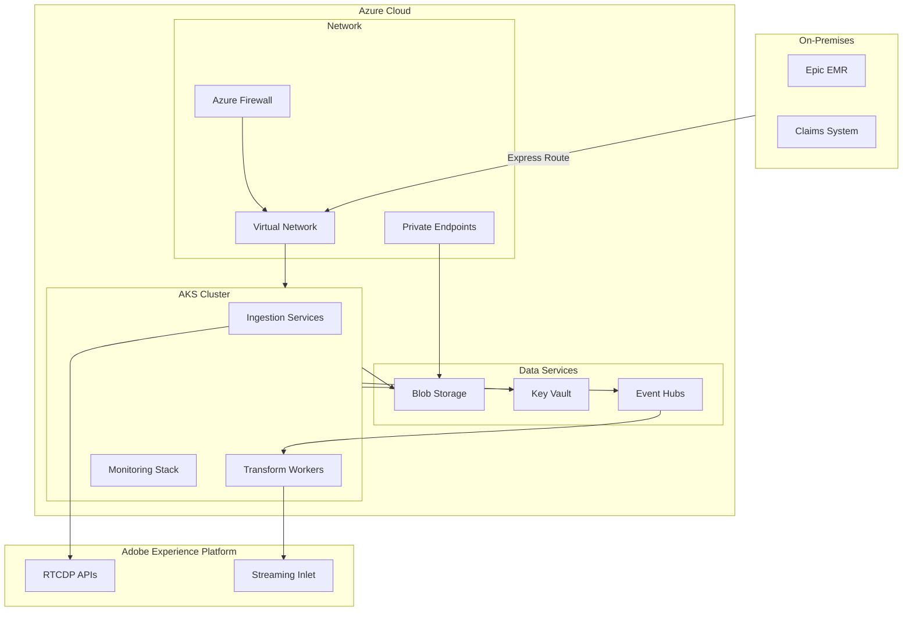

# Deployment Guide

This section provides infrastructure-as-code templates, Kubernetes manifests, and operational runbooks for deploying and managing the RTCDP integration components.

!!! note "Scope"
    These deployment artifacts cover the **custom integration components** (connectors, transformers, monitoring) that support the Adobe RTCDP implementation. Adobe Experience Platform itself is a managed SaaS service.

## Deployment Architecture



## Deployment Documents

| Document | Description | Audience |
|----------|-------------|----------|
| [Infrastructure Guide](infrastructure.md) | Terraform modules for Azure infrastructure | Platform Engineers, DevOps |
| [Kubernetes Manifests](kubernetes.md) | Helm charts and K8s configurations | DevOps, SREs |
| [Operational Runbooks](runbooks.md) | Incident response and maintenance procedures | Operations, Support |

## Quick Start

### Prerequisites

- Azure subscription with appropriate permissions
- Terraform >= 1.6
- kubectl configured for target cluster
- Helm 3.x
- Adobe Experience Platform API credentials

### Deploy Infrastructure

```bash
# Initialize Terraform
cd deploy/terraform
terraform init

# Plan deployment
terraform plan -var-file="environments/prod.tfvars"

# Apply infrastructure
terraform apply -var-file="environments/prod.tfvars"
```

### Deploy Applications

```bash
# Add Helm repository
helm repo add rtcdp-healthcare ./deploy/kubernetes/charts

# Install ingestion services
helm install ingestion rtcdp-healthcare/ingestion \
  --namespace rtcdp \
  --values deploy/kubernetes/values/prod.yaml

# Install monitoring stack
helm install monitoring rtcdp-healthcare/monitoring \
  --namespace monitoring \
  --values deploy/kubernetes/values/monitoring.yaml
```

## Environment Configuration

| Environment | Purpose | SLA | Data |
|-------------|---------|-----|------|
| **Development** | Feature development, testing | Best effort | Synthetic data only |
| **Staging** | Integration testing, UAT | 99% | Anonymized subset |
| **Production** | Live operations | 99.9% | Full PHI (encrypted) |

## Security Considerations

!!! danger "PHI Handling"
    All environments handling PHI must meet HIPAA technical safeguard requirements including encryption, access controls, and audit logging.

### Network Security

- All traffic encrypted in transit (TLS 1.3)
- Private endpoints for Azure services
- Network segmentation via NSGs
- No public endpoints for data services

### Secret Management

- All secrets stored in Azure Key Vault
- Managed identities for service authentication
- Automatic credential rotation
- Audit logging for all secret access

### Access Control

- RBAC for Kubernetes and Azure resources
- Just-in-time access for production
- Break-glass procedures documented
- Quarterly access reviews
