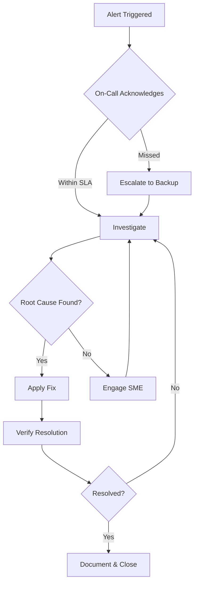

# Operational Runbooks

This document contains operational procedures for managing the RTCDP integration platform.

## Table of Contents

1. [Incident Response](#incident-response)
2. [Common Issues](#common-issues)
3. [Maintenance Procedures](#maintenance-procedures)
4. [Disaster Recovery](#disaster-recovery)

---

## Incident Response

### Severity Levels

| Level | Description | Response Time | Example |
|-------|-------------|---------------|---------|
| **SEV1** | Complete service outage | 15 minutes | All ingestion stopped |
| **SEV2** | Partial outage or data loss | 30 minutes | One source system failing |
| **SEV3** | Degraded performance | 2 hours | High latency in activation |
| **SEV4** | Minor issue | Next business day | Documentation error |

### Incident Workflow



### Escalation Path

1. **L1**: On-call engineer (PagerDuty)
2. **L2**: Platform team lead
3. **L3**: Architecture team
4. **L4**: VP Engineering + Adobe TAM

---

## Common Issues

### Issue: Ingestion Pipeline Stalled

**Symptoms:**
- No new events in Event Hub
- Profile freshness degrading
- Alerts for `ingestion_lag_seconds > 300`

**Diagnosis:**
```bash
# Check pod status
kubectl get pods -n rtcdp -l app=ingestion

# Check for OOMKilled or CrashLoopBackOff
kubectl describe pod <pod-name> -n rtcdp

# Check Event Hub metrics
az monitor metrics list \
  --resource /subscriptions/.../eventhubs/patient-events \
  --metric IncomingMessages \
  --interval PT1M
```

**Resolution:**
```bash
# If pods are unhealthy, restart
kubectl rollout restart deployment/ingestion-service -n rtcdp

# If Event Hub quota exceeded, scale up
az eventhubs namespace update \
  --name rtcdp-prod-events \
  --capacity 4

# If source system issue, check connectivity
kubectl exec -it <pod> -n rtcdp -- curl -v https://source-api.internal
```

---

### Issue: Identity Resolution Failures

**Symptoms:**
- High `identity_conflict_rate` metric
- Profiles not merging as expected
- Duplicate activations to same person

**Diagnosis:**
```bash
# Check identity service logs
kubectl logs -l app=identity-resolver -n rtcdp --tail=500 | grep -i conflict

# Query AEP identity graph via API
curl -X GET "https://platform.adobe.io/data/core/identity/cluster/members" \
  -H "Authorization: Bearer $TOKEN" \
  -H "x-api-key: $API_KEY" \
  -d '{"xid": "email|john@example.com"}'
```

**Resolution:**
1. Review conflicting identity links in AEP UI
2. If bad data, submit identity unlink request
3. If logic issue, update identity priority rules
4. Document in post-incident review

---

### Issue: Consent Sync Lag

**Symptoms:**
- Activations sent despite opt-out
- `consent_freshness_seconds` alert
- Compliance team escalation

**Diagnosis:**
```bash
# Check consent service health
kubectl get pods -n rtcdp -l app=consent-sync

# Verify consent store connectivity
kubectl exec -it <pod> -n rtcdp -- \
  az storage blob list --container-name consent-store --query "[].name" | head

# Check last sync timestamp
kubectl logs -l app=consent-sync -n rtcdp | grep "sync completed"
```

**Resolution:**
```bash
# Force immediate sync
kubectl exec -it <consent-pod> -n rtcdp -- /app/bin/force-sync

# If destination already activated, trigger suppression
curl -X POST "https://platform.adobe.io/data/core/activation/suppress" \
  -H "Authorization: Bearer $TOKEN" \
  -d '{"profileIds": ["...", "..."]}'
```

!!! danger "Compliance Critical"
    Any consent-related incident requires documentation in the compliance incident log within 24 hours.

---

### Issue: High API Latency

**Symptoms:**
- P99 latency > 2s
- Timeout errors in logs
- User complaints about slow activation

**Diagnosis:**
```bash
# Check HPA status
kubectl get hpa -n rtcdp

# View current resource usage
kubectl top pods -n rtcdp

# Check for throttling
kubectl logs -l app=ingestion -n rtcdp | grep -i "429\|throttle\|rate.limit"
```

**Resolution:**
```bash
# Scale up manually if HPA is slow
kubectl scale deployment/ingestion-service --replicas=8 -n rtcdp

# If Adobe API throttling, implement backoff
kubectl set env deployment/ingestion-service \
  RATE_LIMIT_REQUESTS_PER_SECOND=50 -n rtcdp

# If persistent, request quota increase from Adobe
```

---

## Maintenance Procedures

### Scheduled Maintenance Window

**Pre-maintenance checklist:**
- [ ] Notify stakeholders 48 hours in advance
- [ ] Confirm backup completed
- [ ] Verify rollback procedure
- [ ] Stage deployment artifacts

**Maintenance steps:**
```bash
# 1. Enable maintenance mode (stops new ingestion)
kubectl patch deployment ingestion-service -n rtcdp \
  -p '{"spec":{"replicas":0}}'

# 2. Drain existing work
sleep 300  # Allow current batches to complete

# 3. Apply updates
helm upgrade ingestion ./charts/ingestion \
  --namespace rtcdp \
  --values values/prod.yaml

# 4. Verify health
kubectl rollout status deployment/ingestion-service -n rtcdp

# 5. Disable maintenance mode
kubectl patch deployment ingestion-service -n rtcdp \
  -p '{"spec":{"replicas":3}}'
```

### Certificate Rotation

```bash
# Generate new certificate
az keyvault certificate create \
  --vault-name rtcdp-prod-kv \
  --name ingestion-cert \
  --policy @cert-policy.json

# Update Kubernetes secret
kubectl create secret tls ingestion-tls \
  --cert=new-cert.pem \
  --key=new-key.pem \
  --namespace rtcdp \
  --dry-run=client -o yaml | kubectl apply -f -

# Rolling restart to pick up new cert
kubectl rollout restart deployment/ingestion-service -n rtcdp
```

---

## Disaster Recovery

### RPO/RTO Targets

| Component | RPO | RTO | Strategy |
|-----------|-----|-----|----------|
| Profile Data | 0 (managed by Adobe) | N/A | Adobe SLA |
| Event Hub | 1 hour | 2 hours | Geo-replication |
| Configuration | 24 hours | 1 hour | Git + Terraform |
| Secrets | 0 | 30 minutes | Key Vault backup |

### Failover Procedure

```bash
# 1. Assess impact
az resource list --resource-group rtcdp-prod-rg --query "[?properties.provisioningState!='Succeeded']"

# 2. If regional failure, switch to DR region
terraform workspace select dr
terraform apply -var-file="environments/dr.tfvars"

# 3. Update DNS
az network dns record-set a update \
  --resource-group dns-rg \
  --zone-name rtcdp.example.com \
  --name ingestion \
  --set aRecords[0].ipv4Address=$DR_IP

# 4. Verify services
curl -f https://ingestion.rtcdp.example.com/health

# 5. Notify stakeholders
```

### Recovery Validation

After any DR event:
- [ ] All pods healthy in target region
- [ ] Event Hub consuming from last checkpoint
- [ ] Profile freshness recovering
- [ ] No data loss detected
- [ ] Incident report filed within 72 hours
