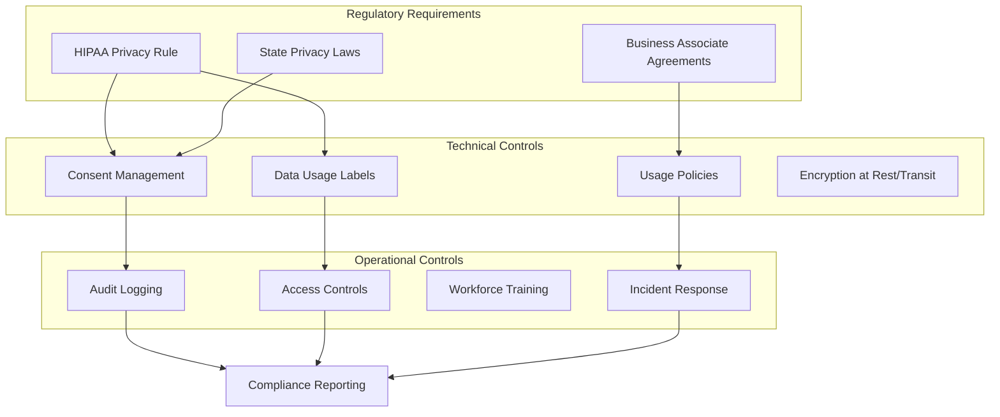
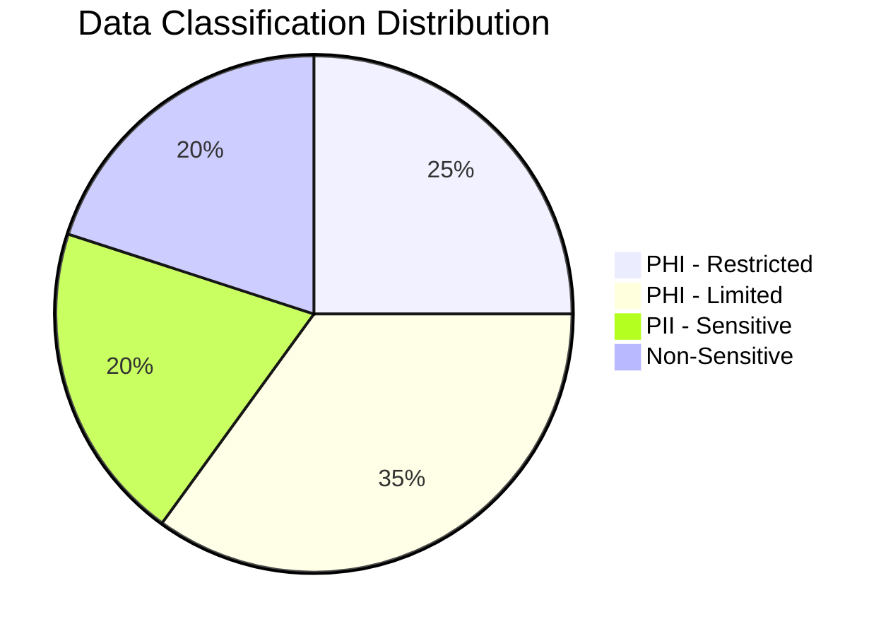

# Governance Overview

This section covers the compliance, consent, and data governance frameworks required for operating a healthcare CDP under HIPAA regulations.

## Governance Framework

## Key Governance Documents

| Document | Description | Audience |
|----------|-------------|----------|
| [Consent & HIPAA Model](consent-hipaa-model.md) | Privacy Rule compliance, BAA requirements, consent architecture | Compliance, Legal, Privacy Officers |
| [Data Governance Framework](data-governance-framework.md) | Data usage labels, policies, stewardship model | Data Stewards, Platform Admins |
| [Failure Mode Analysis](failure-mode-analysis.md) | Identity, consent, freshness, and activation failure scenarios | Engineers, Operations |

## HIPAA Compliance Checklist

!!! warning "Disclaimer"
    This checklist is for architectural planning purposes. Actual compliance requires legal review and formal risk assessment.

### Administrative Safeguards

- [x] Designated Privacy Officer role defined
- [x] Workforce training requirements documented
- [x] Business Associate Agreements mapped
- [x] Incident response procedures outlined

### Technical Safeguards

- [x] Access control mechanisms designed
- [x] Audit logging architecture specified
- [x] Encryption requirements documented
- [x] Automatic logoff/session management planned

### Physical Safeguards

- [x] Cloud provider certifications verified (Adobe BAA)
- [x] Workstation security requirements defined
- [x] Device/media controls documented

## Consent Model

The consent architecture supports multiple consent types with different activation implications:

| Consent Type | Scope | Activation Allowed |
|--------------|-------|-------------------|
| **Marketing** | Email, SMS, Direct Mail | Non-PHI personalization only |
| **Care Coordination** | Appointment reminders, care gaps | Limited PHI with minimum necessary |
| **Research** | De-identified analytics | Aggregated/anonymized only |
| **Third-Party** | Partner activations | Explicit opt-in required |

## Data Classification

### Classification Levels

1. **PHI - Restricted**: Clinical data, diagnoses, treatment records → Never exported to marketing destinations
2. **PHI - Limited**: Appointment history, care team assignments → Care coordination only with consent
3. **PII - Sensitive**: SSN, financial data → Internal operations only
4. **Non-Sensitive**: Engagement preferences, channel opt-ins → Standard marketing use
